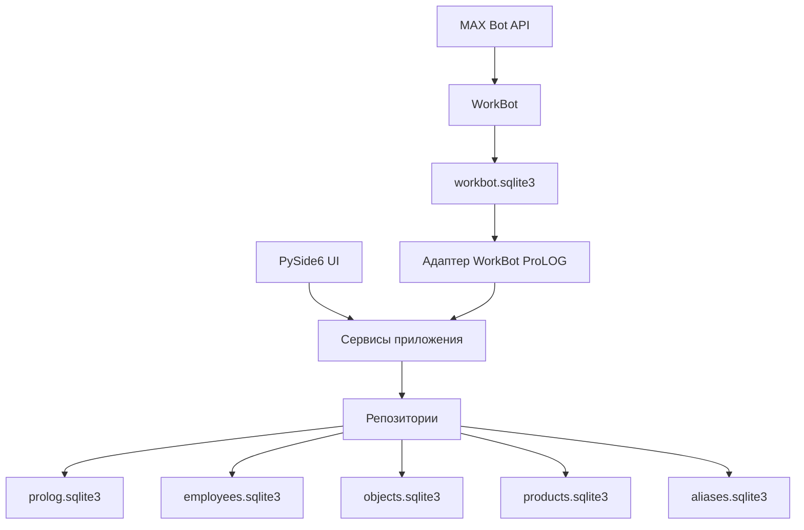
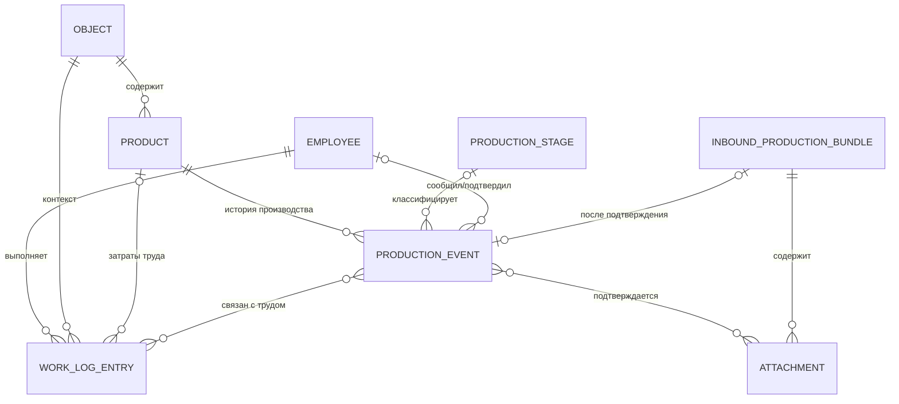

# Архитектурное предложение по развитию ProLOG

Дата аудита: 09.08.2026  
Текущая версия приложения: 0.5.8  
Проверенный коммит: `3db4e62` (`main`)  
Статус документа: архитектурное предложение, без реализации изменений

## 1. Резюме

Текущую архитектуру ProLOG не требуется переписывать перед добавлением учета
хода производства. В проекте уже есть полезный фундамент:

- `WorkLogEntry` является фактом выполненной работы, а Excel — представлением;
- UI в основном работает через сервисы и репозитории, прямого доступа UI к
  SQLite не обнаружено;
- сотрудники, объекты, изделия и алиасы имеют устойчивые числовые ID;
- WorkBot сохраняет исходный текст и использует контролируемую очередь импорта;
- повторный импорт и изменения сообщений обрабатываются идемпотентно;
- текущие рабочие SQLite-файлы проходят `PRAGMA integrity_check`;
- существующий набор из 53 автоматических тестов проходит полностью.

Главный архитектурный вывод: дальнейшее развитие должно быть не
`Employee-centric` и не `Product-centric`, а **event-centric**. Центром модели
являются подтвержденные факты фактической деятельности:

1. `WorkLogEntry` — факт труда сотрудника;
2. `ProductionEvent` — факт изменения или наблюдения хода производства изделия;
3. `Attachment` — неизменяемое доказательство/материал, связанный с
   производственным событием;
4. входящие сообщения MAX — первичный источник, но не доменная истина до
   подтверждения.

Сотрудник, изделие и объект остаются устойчивыми справочными сущностями. Разные
экраны ProLOG должны быть проекциями одних и тех же связанных фактов: экран
сотрудника показывает труд, экран изделия — его производственную хронологию,
экран объекта — совокупность изделий и затрат, аналитика — агрегаты событий.

Новый функционал следует реализовать отдельным модулем `production`, не добавляя
поля фотографий и процентов в `WorkLogEntries` и не превращая
`WorkBotImportRows` в универсальную очередь для любых данных.

## 2. Объем и результаты аудита

Изучены:

- весь Python-код приложения, интеграции WorkBot и старого Excel-импорта;
- модели, сервисы, репозитории, UI-композиция и правила доступа;
- декларативные схемы SQLite и императивные миграции при запуске;
- фактические рабочие базы установленной сборки;
- JSON-справочники и механизм их объединения с поставляемыми версиями;
- сотрудники, объекты, изделия, алиасы, журнал работ и аналитика;
- `CHANGELOG.md`, документация WorkBot и существующие тесты.

Фактическое состояние рабочей копии на момент аудита:

| Хранилище | Основные данные |
|---|---:|
| `prolog.sqlite3` | 99 записей работ, 3911 входящих строк WorkBot |
| `employees.sqlite3` | 48 сотрудников |
| `objects.sqlite3` | 19 объектов |
| `products.sqlite3` | 51 изделие |
| `aliases.sqlite3` | 21 подтвержденный алиас |
| `workbot.sqlite3` | 1214 сообщений, 1847 исторических строк |

Из 99 записей работ 68 уже связаны с изделием, все 99 — с объектом. Не найдено
осиротевших ссылок на сотрудников, объекты, изделия, алиасы или импортированные
записи. Дубликатов ключа `(max_message_id, revision, source_index)` нет.

Это подтверждает работоспособность текущей модели, но не заменяет внешние ключи:
между отдельными SQLite-файлами целостность обеспечивается кодом, а не СУБД.

## 3. Текущая архитектура



### 3.1. Физическое хранение

`Database.connect()` подключает четыре компонентные базы через `ATTACH` к
основной базе. В `prolog.sqlite3` находятся журнал, локальные справочники,
оплата, календарь, настройки и очередь WorkBot. Сотрудники, объекты, изделия и
алиасы вынесены в отдельные файлы.

Такое разделение позволяет выбирать компонентные базы на локальном сервере, но
имеет цену:

- SQLite не поддерживает внешние ключи между присоединенными файлами;
- корректность ссылок зависит от каждого сервисного сценария;
- переключение одного компонента может подключить несовместимый набор ID;
- сетевой SMB-доступ и несколько писателей создают риск блокировок и повреждения
  рабочего процесса;
- добавление нового файла базы не равно созданию правильной модульной границы.

### 3.2. Миграции

Сейчас миграции выполняются императивно в `Database.initialize()`:

1. создаются компонентные схемы;
2. переносятся старые таблицы из монолитной базы;
3. создается основная схема;
4. недостающие столбцы определяются через `PRAGMA table_info` и добавляются;
5. удаляются межфайловые внешние ключи путем пересоздания таблиц;
6. выполняется заполнение справочников и нормализация данных;
7. старые таблицы удаляются.

Отдельного журнала `SchemaMigrations`, номера схемы и контрольной суммы миграции
нет. Запуск приложения одновременно является и запуском мигратора. Для текущего
MVP это работало, но для истории производства и файловых вложений такой механизм
становится недостаточно наблюдаемым.

### 3.3. Справочники

JSON-файлы являются редактируемыми исходными наборами и источником обновлений,
а SQLite — рабочим состоянием. Обновления дополняют пользовательские данные, не
заменяя их полностью. Подход полезен, но создает два уровня истины:

- JSON задает поставляемые значения и привязки к отделам;
- SQLite хранит активность, пользовательские позиции и рабочие ID.

Для новых производственных справочников рабочим источником истины должна быть
SQLite. JSON допустим только как версионированный seed/пакет обновления.

## 4. Текущие доменные сущности

### Основные сущности

- `Employee` — сотрудник, должность, разряд/категория, статус, телефон, дата
  трудоустройства.
- `Object` — производственный объект/контекст договора и заказчика.
- `Product` — изделие, связанное с объектом, его идентификационные данные и
  текущий снимок состояния/готовности.
- `WorkLogEntry` — запись фактически выполненной работы сотрудника за дату.
- `Location` — местонахождение/режим работы.
- `WorkType` — классификация вида труда.
- `Position`, `EmployeeGroup`, `PayRate`, `WorkCalendarDay` — кадрово-расчетный
  справочный контекст.
- `Alias` — подтвержденное соответствие текста сущности ProLOG.
- `MaxUserBinding` — устойчивое соответствие MAX ID сотруднику.
- `WorkBotImportRow` — кандидат, состояние проверки и аудит импорта сообщения.
- `ImportBatch`/`ImportRow` — аудит старого Excel-импорта.
- `AuthProfile`/`UserAccount` — локальная авторизация, хранящаяся в JSON.

### Текущая роль WorkLogEntry

`WorkLogEntry` правильно моделирует трудовой факт:

- кто работал;
- когда;
- где;
- над каким объектом и, при наличии, изделием;
- какой вид работы выполнял;
- сколько часов затратил;
- что именно сделал.

Эту сущность не следует расширять фотографиями, процентом готовности, стадией
производства или состоянием входящего сообщения. Эти данные имеют другую
семантику и жизненный цикл.

## 5. Смешанные ответственности в текущей модели

| Область | Что смешано | Последствие при расширении |
|---|---|---|
| `DirectoryItem` | местонахождение, должность, группа и полноценная карточка объекта | новые поля превращают модель в универсальный контейнер с десятками необязательных атрибутов |
| `DirectoryRepository` / `DirectoryService` | все справочники, объекты, изделия, оплата, календарь, алиасы и UI-настройки | один модуль меняется почти при любой новой функции |
| `ProductItem` | паспорт изделия и текущий изменяемый снимок готовности | отсутствует история, причина и источник изменения процента |
| `WorkLogEntry` | доменная запись и DTO запроса с именами связанных сущностей | модель зависит от формы конкретного SQL-представления |
| `WorkBotImportRows` | снимок источника, результаты распознавания, ручное решение, ревизия и связь с журналом | опасность использовать таблицу как универсальную интеграционную очередь |
| `WorkBotIntegrationService` | разбиение сообщений, сопоставление, алиасы, проверка и импорт | добавление фотографий и производственных событий резко увеличит сложность класса |
| `analytics.py` | трудовые показатели и расчет оплаты | изменение кадровых/расчетных данных задним числом меняет исторические результаты |
| `database.py` | соединение, схемы, миграции, seed и все репозитории | файл уже является точкой концентрации изменений и отказов |
| `ui/dialogs.py` | почти все справочники и служебные диалоги | производственный UI сделает файл неуправляемым |
| `Employee.position/category` | ссылки хранятся текстом, а не историческим ID/снимком | переименование или изменение должности влияет на аналитику прошлого |

Дополнительный риск: семантические правила определяются отображаемым текстом.
Например, нерабочие местонахождения и командировки распознаются по названию.
Переименование пользовательского справочника может изменить валидацию и расчет.
Для новых сущностей нужны стабильные машинные коды, отдельные от названий UI.

## 6. Целевая предметная модель

### 6.1. Общая модель связей



### 6.2. Семантика сущностей

#### Employee

Сотрудник является участником фактических работ, автором или подтверждающим
производственное наблюдение. Он не является контейнером всей информации
приложения.

Прямая связь сотрудника с `ProductionEvent` означает только роль
`reported_by`/`confirmed_by`. Она не должна означать, что именно этот сотрудник
выполнил всю работу над изделием. Исполнители определяются через
`WorkLogEntry`.

#### Object

Объект группирует изделия и трудовые факты. Производственное событие связано с
объектом через изделие. Для исторической устойчивости событие может хранить
`object_id_snapshot`, поскольку карточку изделия сейчас можно переназначить.

#### Product

Изделие хранит устойчивую идентичность и паспортные данные: объект, заводской
номер, наименование, шифр и даты. Текущие `product_status` и
`readiness_percent` на переходном этапе остаются совместимым снимком, но
источником истории становятся только подтвержденные `ProductionEvent`.

#### WorkLogEntry

Факт труда сотрудника. Может быть связан с объектом без изделия или с одним
изделием. Для сценария, в котором одна строка действительно относится к
нескольким изделиям, предпочтительно явное разбиение и распределение часов, а
не список ID внутри одного поля.

#### ProductionEvent

Подтвержденный факт наблюдения или изменения хода производства изделия:

- изделие;
- дата и время наблюдения;
- производственный этап;
- необязательный процент готовности;
- текстовое описание;
- источник и его идентификатор;
- автор сообщения и оператор подтверждения;
- связанные фотографии;
- необязательные связи с записями труда;
- статус и ссылка на исправляемое событие.

Событие после подтверждения не следует молча перезаписывать. Исправление
создает новую ревизию или событие, которое указывает `supersedes_event_id`.

#### Attachment

Неизменяемое метаданное описание файла. Сами фотографии не следует хранить как
SQLite BLOB: это ускорит рост базы, резервное копирование и блокировки. В БД
хранятся относительный ключ файла, SHA-256, MIME-тип, размер, размеры изображения,
исходные ID MAX, даты получения/съемки и имя. Файл хранится в управляемом каталоге
вложений на локальном диске или сервере.

#### ProductionStage

Отдельный справочник производственных этапов со стабильным `code`, названием,
порядком и активностью. Этап не равен виду работ:

- `WorkType` классифицирует труд сотрудника;
- `ProductionStage` классифицирует состояние/этап изделия.

Названия могут совпадать, но объединять справочники нельзя. При необходимости
добавляется явная таблица соответствия этапов видам работ.

#### InboundProductionBundle

Временный входящий пакет: последовательность фотографий и относящийся к ним
текст до подтверждения оператором. Он может быть без изделия, с несколькими
кандидатами или без процента. После подтверждения создает один или несколько
`ProductionEvent`, но сам остается частью аудита источника.

## 7. Событийная модель без конкуренции Employee и Product

Не следует вводить одну универсальную таблицу вида
`Events(entity_type, entity_id, payload_json)`. Она быстро станет EAV-моделью,
скроет ограничения и усложнит аналитику.

Нужно сохранить два типизированных факта:

- `WorkLogEntry` — трудовое событие;
- `ProductionEvent` — производственное событие.

Над ними строится неперсистентная или материализованная read-модель
`ProductionTimelineItem`. Она объединяет события для отображения, но не
подменяет их таблицы.

Представления приложения:

| Экран | Проекция данных |
|---|---|
| Заполнение отчетов | `WorkLogEntry` выбранного сотрудника |
| Входящие отчеты | кандидаты трудовых фактов WorkBot |
| Входящие данные производства | `InboundProductionBundle` до подтверждения |
| Карточка изделия | паспорт `Product` + `ProductionEvent` + вложения + связанные трудозатраты |
| Карточка сотрудника | его `WorkLogEntry` и изделия, к которым относился труд |
| Карточка объекта | изделия, производственные события и агрегированные трудозатраты |
| Аналитика | проекции по сотруднику, изделию, объекту, этапу и периоду |

Таким образом, главным понятием ProLOG становится не сотрудник и не изделие, а
**сеть подтвержденных фактов фактического выполнения**.

## 8. Где должна находиться новая логика

Новый код следует добавлять в отдельный пакет, не перемещая существующие файлы
на первом этапе:

```text
production/
    models.py              # ProductionEvent, Stage, Attachment, InboxBundle
    repository.py          # только SQL нового домена
    service.py             # команды, валидация и транзакционные сценарии
    attachments.py         # файловое хранилище, хэши, проверка и миниатюры
    inbox.py               # жизненный цикл входящего производственного пакета
    matching.py            # изделие, этап, процент; только предложения
    projections.py         # временная шкала и аналитические read-модели

integrations/workbot/
    production_source.py   # чтение медиа-сообщений и их ревизий из WorkBot

ui/
    production_inbox.py    # ручная проверка пакетов
    product_timeline.py    # история изделия
```

Направление зависимостей:

```text
UI -> production.service -> production.repository
                         -> production.attachments

WorkBot adapter -> production.inbox -> production.service

Analytics queries -> production.projections + WorkLog queries
```

UI не обращается к SQLite и файловой системе напрямую. Парсер не создает
подтвержденные события напрямую. Аналитика не должна содержать правила
сопоставления сообщений.

Модульность не требует отдельного SQLite-файла. На первом этапе новые
производственные таблицы лучше разместить в `prolog.sqlite3`, потому что:

- связи событий с `WorkLogEntries` должны быть транзакционными;
- еще один `ATTACH` увеличит число незащищенных межфайловых ссылок;
- отключаемость обеспечивается границей пакета и политикой доступа, а не
  физическим файлом;
- репозиторный интерфейс позволит позже вынести модуль в серверную БД.

## 9. Текущие таблицы, используемые без изменения

На первом этапе можно оставить без изменения:

- `Employees` — участники и авторы;
- `Objects` — контекст изделий и работ;
- `Products` — паспорт изделия и временный снимок текущего состояния;
- `WorkLogEntries` — фактические трудозатраты;
- `Locations`, `WorkTypes`, `Positions`, `EmployeeGroups` — текущие справочники;
- все таблицы алиасов, особенно `ProductAliases`;
- `MaxUserBindings` — связь MAX ID с сотрудником;
- `WorkBotImportRows` — только очередь трудовых отчетов;
- `ImportBatches`, `ImportRows` — аудит старого Excel;
- `PayRates`, `WorkCalendarDays` — существующая расчетная аналитика;
- `Settings` — существующие настройки.

Важно: `WorkBotImportRows` нельзя переиспользовать для фотоистории, а
`WorkTypes` нельзя переименовать в производственные этапы.

## 10. Новые таблицы

### 10.1. Обязательный первый набор в `prolog.sqlite3`

#### `SchemaMigrations`

- `component`;
- `version`;
- `name`;
- `checksum`;
- `app_version`;
- `applied_at`;
- составной уникальный ключ `(component, version)`.

Журнал миграций должен существовать в каждом независимо выбираемом файле базы,
а не только в основной базе.

#### `ProductionStages`

- `id`;
- `code` — стабильный уникальный машинный код;
- `name`;
- `sort_order`;
- `is_active`;
- `created_at`, `updated_at`.

#### `ProductionEvents`

- `id`;
- `product_id` — обязателен для подтвержденного события;
- `object_id_snapshot`;
- `stage_id`;
- `event_type` (`observation`, `progress`, `stage_change`, `rework`, `baseline`);
- `readiness_percent` — `NULL` или 0..100;
- `description`;
- `observed_at_utc`, `recorded_at_utc`;
- `source_type`, `source_ref`;
- `reported_by_employee_id`;
- `status` (`draft`, `confirmed`, `superseded`, `rejected`);
- `supersedes_event_id`;
- `created_by`, `confirmed_by`;
- `idempotency_key` — уникальный;
- `created_at`, `confirmed_at`.

Внешние ключи внутри `prolog.sqlite3` должны быть реальными. Ссылки на
`Products` и `Employees` остаются межфайловыми и проверяются сервисом и
диагностикой целостности.

#### `Attachments`

- `id`;
- `storage_key` — относительный путь/ключ, не абсолютный путь конкретного ПК;
- `sha256`;
- `original_name`;
- `mime_type`, `size_bytes`, `width`, `height`;
- `captured_at_utc`, `received_at_utc`;
- `source_type`, `source_message_id`, `source_attachment_id`;
- `created_at`;
- уникальный ключ источника и индекс по SHA-256.

#### `ProductionEventAttachments`

- `production_event_id`;
- `attachment_id`;
- `sort_order`;
- составной первичный ключ.

#### `ProductionEventWorkLogs`

- `production_event_id`;
- `worklog_entry_id`;
- `relation_type` (`explicit`, `same_product_period`, `manual`);
- `created_at`, `created_by`;
- составной первичный ключ.

Связь должна быть необязательной и многие-ко-многим. Нельзя автоматически
утверждать, что автор фото выполнил все связанные работы.

#### `ProductionInboxBundles`

- `id`;
- `chat_id`, `sender_max_user_id`;
- `opened_at_utc`, `closed_at_utc`;
- `raw_description`;
- `detected_product_id`, `detected_stage_id`, `detected_readiness_percent`;
- `confidence`, `parser_version`;
- `status` (`collecting`, `needs_description`, `needs_product`, `ready`,
  `confirmed`, `changed`, `rejected`);
- `error_message`;
- `content_hash`;
- `production_event_id`;
- `created_at`, `updated_at`, `reviewed_by`, `reviewed_at`.

#### `ProductionInboxMessages`

- `bundle_id`;
- `max_message_id`, `revision`;
- `sequence_number`;
- `raw_text`;
- `received_at_utc`;
- `content_hash`;
- уникальный ключ `(max_message_id, revision)`.

#### `ProductionInboxAttachments`

- `bundle_id`;
- `attachment_id`;
- `sequence_number`;
- составной первичный ключ.

### 10.2. Дополнения к `workbot.sqlite3`

#### `message_revisions`

Хранит каждую полученную редакцию сообщения, а не только последнее состояние:
ID сообщения, номер редакции, сырой текст/метаданные, время и хэш.

#### `message_attachments`

Хранит метаданные вложений MAX: ID сообщения, ID вложения, тип, URL/токен
загрузки, исходное имя, MIME, размер, порядок, локальный ключ и SHA-256.

Текущий WorkBot отбрасывает сообщение до сохранения, если в нем нет текста.
При реализации медиа этот порядок должен измениться: сначала сохраняется
конверт сообщения и вложения, затем запускается текстовый парсер.

### 10.3. Рекомендуемый аудит изменений

До использования данных в научной работе желательно добавить
`WorkLogRevisions`: снимок записи до изменения/удаления, пользователь, причина и
время. Сейчас `WorkLogEntries` можно редактировать и удалять, поэтому без такого
аудита обучающий набор не будет полностью воспроизводимым.

## 11. Правила группировки фото и текста из MAX

Нельзя связывать текст с «предыдущими фотографиями» только по глобальному
порядку сообщений. Минимально безопасный алгоритм:

1. WorkBot сохраняет любое сообщение, в том числе только с фотографиями.
2. Открытый пакет определяется парой `(chat_id, sender_max_user_id)`.
3. Последовательные фотографии добавляются в открытый пакет в исходном порядке.
4. Следующее текстовое сообщение того же автора в том же чате закрывает пакет,
   если попадает в настраиваемое временное окно.
5. Пакет без текста получает `needs_description`; текст без ожидающих фото не
   присоединяется задним числом автоматически.
6. Новый день, другой автор, слишком большой интервал или явный разделитель
   закрывают пакет и отправляют его на проверку.
7. Редактирование текста создает новую ревизию и состояние `changed`, но не
   переписывает подтвержденное событие.
8. Повторная доставка определяется ID сообщения, редакцией и ID вложения.
9. Изделие определяется по заводскому номеру, шифру, алиасу и контексту объекта.
10. Если текст содержит несколько изделий или несколько процентов, система
    предлагает разбиение; неоднозначность подтверждает человек.

Фразы вида `ШУ1 сборка 70%`, `ВРУ слесарка` и
`ШУФ электромонтаж 40%` должны разбираться на независимые предложения:
`product candidate`, `stage candidate`, `readiness candidate`. Исходный текст и
фотографии остаются неизменными вне зависимости от результата распознавания.

## 12. Аналитика и научный датасет

Текущая аналитика агрегирует `WorkLogEntries` по объекту, изделию, сотруднику,
виду работ и дате. Производственный модуль должен добавить проекции, а не
встраивать расчеты в сущности:

- история готовности изделия во времени;
- время нахождения на каждом этапе;
- изменение процента между подтвержденными наблюдениями;
- сотрудники, часы и стоимость по изделию и этапу;
- трудозатраты между двумя производственными наблюдениями;
- число фотографий и полнота наблюдений;
- длительность цикла от начала до выпуска;
- сравнение изделий одного типа/шифра;
- доля ручных исправлений распознавания.

Для достоверной исторической стоимости текущих данных недостаточно: аналитика
использует сегодняшнюю должность, разряд и ставку сотрудника. Изменение справочника
может изменить результат прошлого периода. Перед финансово значимой или научной
аналитикой нужны снимки расчетного контекста на дату работы либо версионированные
ставки и кадровые назначения.

Для будущего датасета необходимо раздельно хранить:

- сырой источник MAX;
- предложение детерминированного парсера;
- подтвержденную человеком разметку;
- исправления и причины;
- версию правил или модели;
- производственные события;
- трудозатраты;
- признаки изделия;
- ссылки и хэши изображений.

AI в дальнейшем должен выдавать предложение и уверенность, но не менять
подтвержденную историю без оператора. Именно расхождения предложения и решения
оператора будут наиболее ценными размеченными данными.

## 13. Необходимые миграции

### Миграция 0. Контроль перед изменениями

- определить активные пути всех компонентных баз через реестр;
- сделать согласованную резервную копию баз и будущего каталога вложений;
- выполнить `integrity_check` и проверку межфайловых ссылок;
- зафиксировать число строк и контрольные суммы;
- не запускать миграцию, если приложение/WorkBot продолжают запись.

### Миграция 1. Версионирование схем

- добавить `SchemaMigrations` в каждый выбираемый SQLite-файл;
- зарегистрировать текущее состояние как baseline без пересоздания таблиц;
- выполнять миграции последовательно, транзакционно и ровно один раз;
- запретить запуск новой программы на более новой неизвестной схеме.

### Миграция 2. Производственный домен

- добавить этапы, события, вложения и таблицы связей в `prolog.sqlite3`;
- добавить индексы по изделию, времени, статусу, этапу, SHA-256 и источнику;
- не изменять существующие записи работ и изделий.

### Миграция 3. Медиа WorkBot

- добавить ревизии и вложения в `workbot.sqlite3`;
- сохранить совместимость с текущими текстовыми сообщениями;
- начать принимать медиа-сообщения без требования текста.

### Миграция 4. Входящая очередь производства

- добавить пакеты, сообщения пакета и связи с вложениями;
- реализовать идемпотентный импорт и повторную проверку изменений;
- не создавать `ProductionEvent` автоматически при неоднозначности.

### Миграция 5. Переход текущей готовности

Текущий процент изделия нельзя выдавать за историческое событие с неизвестной
датой. Допустим один из вариантов:

- оставить его только как legacy-снимок до первого подтвержденного события;
- создать событие `baseline` датой миграции с явным источником
  `legacy_snapshot`.

Запрещено искусственно датировать baseline началом производства.

### Миграция 6. Проекции и аудит

- обновлять совместимый снимок `Products.readiness_percent` только после
  подтверждения события;
- добавить ревизии трудовых записей;
- включить диагностику ссылок в штатную проверку базы;
- добавить резервное копирование файлов вместе с метаданными.

Все миграции должны быть аддитивными. Удаление старых полей возможно только
после отдельного периода совместимости и не требуется для MVP производства.

## 14. Главные риски архитектурного «Франкенштейна»

### Критические

1. **Добавление фотографий и стадий в `WorkLogEntries`.** Трудовой факт и
   наблюдение производства имеют разные авторов, время, правила исправления и
   кратность.
2. **Расширение `WorkBotImportRows` до общей очереди.** Трудовой отчет и пакет
   фото имеют разные состояния и ключи идемпотентности.
3. **Еще один универсальный `DirectoryItem`.** Производственные события и
   вложения должны иметь собственные модели.
4. **Еще одна компонентная SQLite только ради слова «модуль».** Это увеличит
   число межфайловых ссылок без реальной изоляции.
5. **Сетевой SQLite с несколькими одновременно пишущими клиентами.** До
   многокомпьютерной эксплуатации нужен нагрузочный тест и режим одного писателя
   либо серверный API/СУБД.
6. **Хранение фотографий как BLOB.** Резко растут база, блокировки и стоимость
   резервного копирования.

### Высокие

7. **Миграции без журнала версий.** Невозможно доказать, какие изменения уже
   применены к конкретному выбранному файлу.
8. **Ретроактивная аналитика.** Текущие должности, ставки, названия и привязки
   изменяют трактовку прошлого.
9. **Утрата первоисточника при редактировании MAX.** Сейчас WorkBot хранит в
   `messages` только последнее состояние текста.
10. **Автоматическое подтверждение неоднозначного AI/парсинга.** Ошибка станет
    частью истории готовности и обучающего набора.
11. **Абсолютные пути к вложениям.** Перенос базы на сервер или другой ПК
    разорвет ссылки.
12. **Продолжение роста `database.py` и `ui/dialogs.py`.** Новая функция будет
    затрагивать слишком много несвязанных областей.

### Средние

13. Дублирование источника истины между JSON и SQLite.
14. Бизнес-правила, зависящие от пользовательского текста справочника.
15. Локальная JSON-авторизация при общих сетевых данных: она не является
    серверной границей безопасности и не защищает файлы ставок от прямого
    доступа.
16. Наивные локальные timestamps без единой UTC-политики.
17. Отсутствие общей резервной копии «БД + файлы вложений».

## 15. Что не следует добавлять в ProLOG

Чтобы сохранить предметную область, в ядро ProLOG не следует добавлять:

- воронку продаж, лиды, коммерческие предложения и CRM;
- бухгалтерский и налоговый расчет зарплаты, НДФЛ, взносы и проводки;
- складские остатки, закупки, заказы поставщикам и полноценный учет материалов;
- MRP/ERP-планирование, диспетчеризацию мощностей и нормативное производство;
- договорной документооборот, согласование и электронную подпись;
- кадровый учет отпускных приказов, больничных и личных дел;
- ремонтное обслуживание оборудования как EAM/ТОиР;
- собственный мессенджер, копирующий MAX;
- GPS-контроль сотрудников и иные функции наблюдения;
- автоматическое создание объектов/изделий из непроверенного текста;
- автономное AI-решение, которое без подтверждения меняет факты;
- хранение произвольных документов без связи с работой или производственным
  событием.

Оценка стоимости труда может оставаться аналитическим подключаемым модулем, но
не должна развиваться в регламентированный расчет заработной платы. Аналогично,
реквизиты договора в объекте допустимы как производственный контекст, но не как
начало CRM.

## 16. Поэтапный план внедрения

### Этап 0. Архитектурная стабилизация

- утвердить этот документ и четыре решения: событийная модель, хранение файлов,
  миграции, режим эксплуатации SQLite;
- добавить версионированный мигратор и проверку межфайловой целостности;
- определить единое активное расположение рабочих баз;
- определить каталог вложений и политику резервного копирования;
- добавить тесты аналитики, миграций и историчности.

Критерий: существующее приложение работает без изменения поведения, а версия
каждой базы диагностируется однозначно.

### Этап 1. Медиа-фундамент WorkBot

- сохранять сообщения без текста;
- хранить ревизии и метаданные вложений;
- безопасно скачивать фотографии;
- считать SHA-256 и использовать относительные storage keys;
- покрыть повторную доставку, редактирование и сбой загрузки тестами.

Критерий: ни одна фотография не теряется и не дублируется, исходный порядок
воспроизводим.

### Этап 2. Производственный домен без автоматического распознавания

- добавить этапы, события и вложения;
- сделать ручное создание события для существующего изделия;
- показать временную шкалу изделия;
- реализовать исправление через ревизию/замещение;
- обновлять текущий снимок готовности только подтвержденным событием.

Критерий: история изделия с фотографиями воспроизводима и не зависит от MAX.

### Этап 3. Входящая производственная очередь

- группировать фото и следующий текст в пакет;
- показывать первоисточник оператору;
- предлагать изделие, этап и процент;
- разделять сообщение на несколько событий только при доказуемой структуре;
- отправлять все неоднозначности на ручную проверку.

Критерий: повторная синхронизация не создает дубликаты, изменение MAX не меняет
подтвержденную историю молча.

### Этап 4. Производственная аналитика

- добавить проекции по изделию, объекту, этапу и периоду;
- связать трудозатраты с событиями и интервалами;
- считать длительность этапов, готовность и стоимость;
- показывать полноту и качество данных.

Критерий: каждый агрегат раскрывается до исходных работ, событий и фотографий.

### Этап 5. Подготовка научного датасета

- добавить аудит изменений WorkLog;
- версионировать ставки и кадровые назначения либо сохранять снимки;
- определить словарь признаков и экспорт датасета;
- отделить подтвержденную разметку от машинных предложений;
- формализовать хранение, доступ и обезличивание изображений.

Критерий: результат исследования можно воспроизвести на зафиксированной версии
данных и правил.

### Этап 6. AI как помощник

- начинать с классификации изделия/этапа и извлечения процента;
- сохранять имя и версию модели, уверенность и предложенный результат;
- измерять точность на подтвержденной выборке;
- не включать автоподтверждение до достижения согласованных метрик.

Критерий: AI сокращает ручную работу, но не является источником доменной истины.

### Этап 7. Серверная эволюция при фактической необходимости

Переход к API и серверной СУБД нужен не «на вырост», а при появлении одного из
условий:

- несколько компьютеров одновременно записывают данные;
- WorkBot и ProLOG должны работать независимо и круглосуточно;
- фотографии хранятся централизованно;
- необходим централизованный доступ и аудит прав;
- блокировки SQLite становятся эксплуатационной проблемой.

Благодаря репозиториям и сервисной границе этот переход не должен менять
доменную модель.

## 17. Решения, которые нужно зафиксировать до реализации

Рекомендуется оформить короткие ADR:

1. **ADR-001: Event-centric model.** `WorkLogEntry` и `ProductionEvent` — разные
   типизированные факты; экраны являются проекциями.
2. **ADR-002: Attachment storage.** Метаданные в SQLite, файлы вне БД, ссылки
   относительные, обязательны SHA-256 и согласованный backup.
3. **ADR-003: SQLite deployment.** Для MVP один писатель; критерии перехода к
   серверной СУБД определены заранее.
4. **ADR-004: Corrections.** Подтвержденные производственные события не
   перезаписываются без истории.
5. **ADR-005: Human-in-the-loop.** Парсер и AI предлагают, оператор подтверждает
   неоднозначные связи.

## 18. Итоговая оценка

ProLOG готов к аккуратному расширению, но не к механическому добавлению новых
полей в существующие сущности. Сильная сторона проекта — уже существующая
модель фактических работ и контролируемого импорта. Слабая сторона — концентрация
разных обязанностей в универсальных моделях, репозиториях, миграционном файле и
крупных UI-модулях.

Оптимальный следующий шаг — не рефакторинг всего приложения, а сначала
версионированные миграции и новый изолированный домен `production` с
`ProductionEvent`, `Attachment`, входящей очередью и проекциями. Такой путь
сохраняет работающий MVP, не превращает ProLOG в ERP и создает достоверную
историю для аналитики и будущей научной работы.

## 19. Принятые уточнения

После рассмотрения предложения зафиксированы обязательные решения:

- event-centric архитектура сохраняется;
- `WorkLogEntry` и будущий `ProductionEvent` остаются разными фактами;
- отдельный SQLite-файл production не создается;
- `ProductionStage` и `WorkType` остаются разными справочниками;
- фотографии в будущем хранятся вне SQLite;
- `WorkBotImportRows` не используется для производственных отчетов;
- парсер и AI не являются источником подтвержденного факта;
- `Employee` (участник производства) и `User/Actor` (субъект действия в системе)
  являются разными сущностями;
- существующие `id INTEGER` сохраняются, а будущая глобальная идентичность API
  реализуется отдельным неизменяемым `uid UUID`.

UUID не добавляются существующим строкам в этапе 0, поскольку это изменило бы
пользовательские данные без текущего потребителя. Безопасная аддитивная
миграция описана в `docs/adr/ADR-006-global-identifiers.md`.

Нормативными дополнениями к предложению являются ADR-001..ADR-006 в каталоге
`docs/adr/`. Последовательность будущей реализации описана в
`PRODUCTION_IMPLEMENTATION_PLAN.md`.
